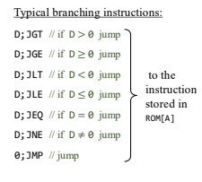

# Sesión 2: Modelo Hack y ciclo fetch-decode-execute
## Objetivo: ¿Qué se buscaba aprender o lograr?
Las instrucciones básicas del lenguaje ensamblador
## Proceso: Pasos que seguiste para completar la actividad
- Escuchar la explicacion del profesor
- Leer el notion
- Contestar las preguntas segun lo explicado en clase
- Investigar conceptos nuevos o vacios conceptuales que hayan quedado
```
		@1
			D=A
			@2
			D=D+A
			@16
			M=D
(END)
			@END
			0;JMP
```

**¿Qué hace línea por línea?**
Esta es mi explicación linea por linea:
1. `@1` Se apunta la direccion del casillero numero 1 (A=1).
2. `D=A` El numero guardado en A fue el numero del casillero, en esta linea se guarda temporalmente en D (A=1 y D=1).
3. `@2`se llama al casillero 2 (A=2).
4. `D=D+A` Se toma el 1 guardado anteriormente en D, se le suma el 2 guardado en A y se guarda el resultado en d es decir en este momento dle programa D=3, como podemos evidenciar con este screenshot del simulador:

5. `@16` Se llama al casillero número 16
6. `M=D` Se toma el contenido guardado en D y se guarda en el casillero número 16.
7. `@END
			0;JMP` Fin del programa.

**¿Qué hace el programa en general?**
El propósito principal de este programa es guardar el número 3 en el casillero número 16 .

## Conceptos clave:
**Fetch (buscar):** la CPU obtiene (lee) la siguiente instrucción desde la memoria. El contador de programa (PC) indica dónde se encuentra esa instrucción en la memoria ROM.

**Decode (decodificar):** la CPU interpreta la instrucción que acaba de leer. Esto significa entender qué operación debe realizarse y qué datos o recursos necesita.

**Execute (ejecutar):** la CPU realiza la operación indicada. Por ejemplo, puede ser una operación matemática, mover datos entre registros, o acceder a la memoria.

## Preguntas en clase

`¿Qué sucede?` Se realiza el programa de la manera que anticipé.

``¿Qué valor se almacena en la dirección de memoria 16?`` 3

 ``¿Por qué crees que es ese valor?`` Porque después de realizar la operación matemática, llamamos al casillero 16 y con **M=D** guardamos el resultado de la operación dentro de este casillero. Según la explicación del profesor, M es el contenido del casillero que se haya llamado mas recientemente, se puede saber en que casillero se guardó viendo los registros, en específico el registro A, este dicta el número del casillero que esté seleccionado.

 ``¿Qué instrucciones se ejecutan en cada ciclo Fetch-Decode-Execute? `` Realmente cada instrucción contiene un cciclo fetch decode y execute, pero este ejercicio me parece relevante para entender mejor cómo funciona cada uno, en el ejemplo del programa, yo diría que:
 -  cada línea @x es fetch, ya que esta buscando una dirección de memoria en la ram.
 - cada línea de x=x sería execute, ya que es una accion mas definitiva que altera la memoria directamente
 - la unica que yo considero que califica como decode, seria D=D+A ya que se esta calculando una operacion matematica que requiere el funcionamiento de la ALU y requiere un nivel mas complicado de 

 ``¿Qué cambios observas en el contenido de la memoria y los registros?``
 En los registros noto que cada uno sigue un patrón diferente respecto a los pasos del programa:
``PC`` cada vez que se avanza un paso el numero aumenta de 1 en 1
``A``, cada vez que se llama una dirección con la etiqueta @ se guarda ese numero en el registro
``D``, cada vez que se hace una instruccion D=x se guarda un numero nuevo en este registro temporal. Y en cuanto a la memoria, en el casillero 16 podemos ver como al final se guarda el número tres.

# Aprendizaje: Conceptos nuevos que adquiriste
 ## Conceptos de lenguaje ensamblador: Saltos

 

 En esta imagen están los diferentes tipos de saltos, los cuales son muy importantes en la programación en lenguaje ensamblador ya que a partir de estos se pueden crear ciclos y condicionales en el programa. 

 para usarlos primero debe escribir una direccion y escribir el jump, este solo hace comparaciones con 0

 ## Números negativos en 3 bits
  
 Entendí mejor el funcionamiento del lenguaje ensamblador y como crean números negativos con el compuesto a 2 del no binario usando compuertas lógicas, asi "engañan" al computador para que reste y sume números tanto positivos como negativos.

 ## Investigación: variables y etiquetas en lenguaje ensamblador

 En lenguaje ensamblador, las variables son nombres simbólicos para posiciones de memoria que almacenan datos, mientras que las etiquetas representan direcciones de instrucciones a las que el procesador puede saltar. Ambas sustituyen el uso de direcciones numéricas directas para facilitar la escritura y lectura del código.
 
 ``Variables``
 Las variables se definen utilizando directivas de asignación (como DB para bytes, DW para palabras) en un segmento de datos, permitiendo reservar espacio y asignar valores iniciales

 ``Etiquetas``
 Una etiqueta es un nombre seguido de dos puntos (:) que marca el inicio de una línea o bloque de código. Se utiliza comúnmente con instrucciones de salto (JMP, CALL) para alterar el flujo de ejecución.

 ## Resultados: Lo que obtuviste o lograste

 Entendí mejor el funcionamiento del lenguaje ensamblador y como crean números negativos con el compuesto a 2 del no binario usando compuertas lógicas, asi "engañan" al computador para que reste y sume números tanto positivos como negativos.