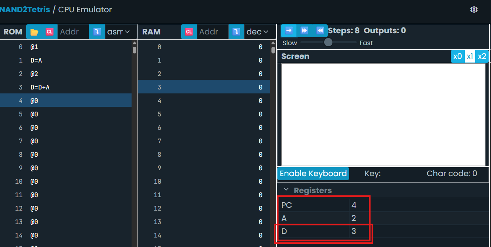

# Sesión 2
## Modelo Hack y ciclo fetch-decode-execute
```
		@1
			D=A
			@2
			D=D+A
			@16
			M=D
(END)
			@END
			0;JMP
```

**¿Qué crees que haga este programa?**
Esta es mi explicación linea por linea:
1. `@1` Se llama la direccion del casillero numero 1 (A=1).
2. `D=A` El numero guardado en A fue el numero del casillero, en esta linea se guarda temporalmente en D.
3. `@2`se llama al casillero 2 (A=2).
4. `D=D+A` Se toma el 1 guardado anteriormente en D, se le suma el 2 guardado en A y se guarda el resultado en d es decir en este momento dle programa D=3, como podemos evidenciar con este screenshot del simulador:

5. `@16` Se llama al casillero número 16
6. `M=D` Se toma el contenido guardado en el casillero número 16 y se guarda en D.
7. `@END
			0;JMP` Fin del programa.