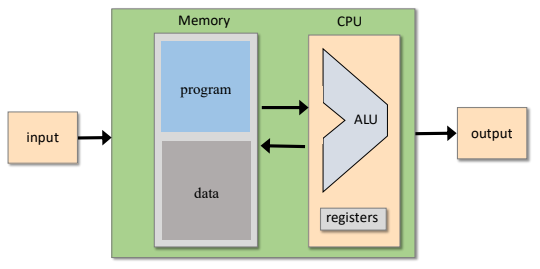
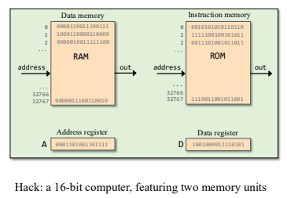
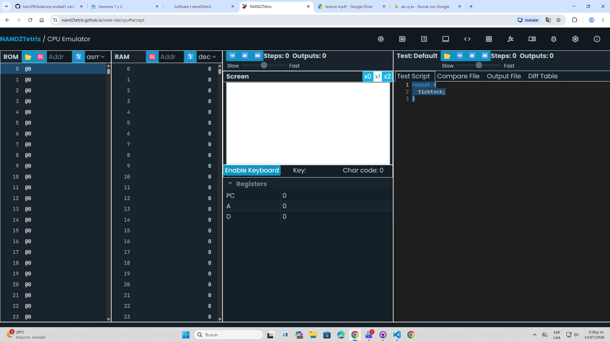

# Sesión 1
## Objetivo: ¿Qué se buscaba aprender o lograr?
- Entender como funciona un computador sencillo (Hack), para después facilitar el estudio de uno más complejo.
- Controlar el flujo de un programa
- Aprender lenguaje ensamblador

## Proceso: Pasos que seguiste para completar la actividad
- Leer detalladamente la descripción de la unidad en Notion.
- Escuchar la explicación del profe sobre las imagenes mostradas en la presentación de Nand2tetris, Proyecto 4.
- Usando el simulador gratuito de nand2tetris experimente con el lenguaje ensamblador siguiendo las explicaciones del profesor

## Resultados: Lo que obtuviste o lograste
- Entender los conceptos explicados por el profesor

## Aprendizaje: Conceptos nuevos que adquiriste
*Arquitectura del Computador:*

- Entrada: teclado, mouse, micrófono, cámara
- Salida: monitor, parlante, audífonos, impresora
- CPU Central Processing Unit: dentro de esta la ALU Aritmetic Logic Unit y los registros, en los cuales estan los casilleros A (adress, o direcciones de casilleros) D (casillero temporal) y PC (program counter o contador de pasos). Conectado a esta unidad hay unos buses que transportan datos hacia y desde la memoria.
Esta se encarga de hacer los ciclos de Fetch-Decode-Execute, en donde busca los datos a la memoria, los analiza y realiza una acción deacuerdo a las instrucciones de un programa.
- Memoria: hay dos tipos de memoria, de solo lectura ROM (program) y de acceso libre RAM (data) 

El computador Hack tiene 16 bits, o sea que la memoria máxima es de 786.432

- ¿Por qué hicieron el cambio de 32 a 64 bits?
La version anterior tenia 32, es decir los buses tenian 32 bits o sea que las instrucciones debian ejecutarse por partes. Además la maxima memoria que podia tener un pc era de 4 gb, ahora con 64 es mayor exponencialmente y es una cantidad que nunca vamos a alcanzar.

*Lenguaje Ensamblador*
Usando la herramienta gratuita del curso nand2tetris para simular la computadora hack, practicamos la lógica más básica de programación bajo la cual funcionan gracias al lenguaje máquina.

Estos fueron las funciones que aprendimos en la clase de hoy:

D es un registro donde se guarda un valor temporalmente
M es el contenido de un casillero seleccionado
A es el número por el cual se identifica un casillero

Existen funciones de operación y de dirección:
@ es para llamar un casillero
 =, @ y + sólo con estas letras, los números para hacer las operaciones se consiguen a partir de llamar un casillero por su número identificador y guardarlo en el registro temporal D.

Ejemplo:
```asm
@6
D=M

```
En este programa llame al casillero numero 6, y despues guarde el contenido del casillero en el csillero d para guardar datos temporalmente.

## Conclusiones: Reflexión sobre la importancia de lo aprendido
Fue una buena primera sesión porque a partir de esta se crearon las bases para entender bien el funcionamiento de una computadora.