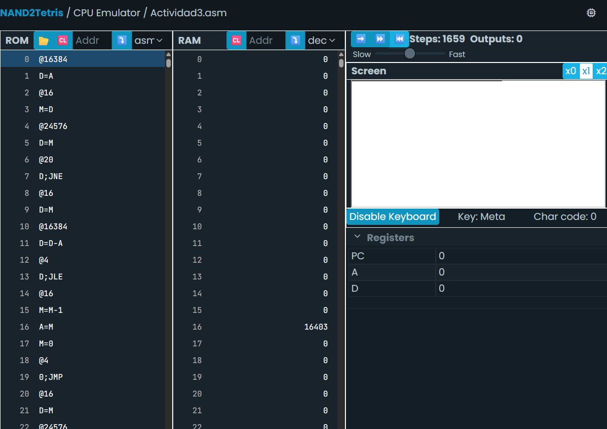

# Sesión 3: Instrucciones, ALU, registros, saltos y control de flujo en Hack

 - **Objetivo:** ¿Qué se buscaba aprender o lograr?

 Entender un programa escrito en lenguaje ensamblador y descubrir qué hace, cómo funciona y que herramientas de programacion utiliza tal como condicionales, bucles etc.
- **Proceso:** Pasos que seguiste para completar la actividad

Leer y analizar el programa línea por línea, desglosar el significado en general de cada grupo de código y cómo se ejecutaría en el computador hack.
- **Resultados:** Lo que obtuviste o lograste

- **Aprendizaje:** Conceptos nuevos que adquiriste
- **Dificultades y soluciones:** Obstáculos que encontraste y cómo los superaste
- **Conclusiones:** Reflexión sobre la importancia de lo aprendido

## 🧐**🧪✍️** Ahora experimenta.

- Analisis inicial del programa:
``@SCREEN`` apunto la dirección del registro del computador hack destinado a la pantalla (16384)
``D=A`` guardo el numero de la dirección en el registro D
``@i`` asigno una variable llamada i (se guarda en el registro numero 16)
``M=D`` guardo el numero de direccion de la pantalla en la variable
``(READKEYBOARD)`` Función principal del programa
``@KBD`` uso la etiqueta kbd para apuntar la dirección del registro del computdor hack asignado al teclado (24576)
``D=M`` guardo el contenido del registro (depende el numero de la tecla que se este presionando) en el registro D
``@KEYPRESSED`` llamo a la etiqueta keypressed
``D;JNE`` uso una funcion jump para decirle a la cpu que salte a esa etiqueta si el contenido del registro d es diferente a 0. (recordemos que acabamos de guardar el contenido del kbd, es decir si se esta presionando una tecla, sera diferente a 0 y si no, este permanecera 0 y el programa seguira ejecutandose linealmente)
``@i`` apunto la direccion del registro en el cual se guardo la variable i que inicializamos hace un rato
``D=M`` anoto el contenido de la variable en el registro temporal D, aqui habiamos anotado el registro asignado a la pantalla
``@SCREEN`` apunto la direccion de la pantalla otra vez
``D=D-A`` le resto la dirección de la pantalla al contenido de D que era el registro de la pantalla y lo guardo en D (D=0)
``@READKEYBOARD`` referencio otra etiqueta llamada readkeyboard
``D;JLE`` le digo a la cpu con una funcion jump que salte a la etiqueta si el contenido guardado en D es menor o igual a 0 (actualmente si lo es)
``@i`` apunto la direccion de la variable i
``M=M-1`` al contenido de la variable le resto 1 y lo guardo en la variable (RAM16 = 16383)
``A=M`` me ubico en la dirección igual al contenido de i, que es la direccion de la pantalla menos 1
``M=0`` borro el contenido del registro igualandolo a 0
``(KEYPRESSED)`` aqui es donde le dije a la cpu que saltara (etiqueta readkeyboard.) en caso de cumplir la condicion de estar presionando una tecla
20. apunto la variable que cree
21. guardo el contenido de la variable en d
22. apunto la direccion del teclado y se la resto a d
23. aqui es a donde le dije que saltara en el punto 

## 📤 **Bitácora**

Reporta en tu bitácora de aprendizaje:

- Identifica una instrucción que use la ALU y explica qué hace.

r/ Cuando resto y sumo contenidos estoy usando la alu, lo que hace la alu es usar lógica creada artificialmente con compuertas lógicas para sumar, restar y comparar valores.

- ¿Para qué sirve el registro PC?

r/ Sirve para indicar por que paso del programa voy es decir que registro de la rom

- ¿Cuál es la diferencia entre @i y @READKEYBOARD?

r/ i es una variable que se guardo en el registro 16 de la ram mientras readkeyboard es una etiqueta que se usa para saltar a una parte del programa que tiene instrucciones especificas.

- Describe qué se necesita para leer el teclado y mostrar información en la pantalla.

r/ Para leer el teclado es necesario usar una instrucción con @ y llamar al registro en la RAM destinado para el teclado, en el contenido de este casillero va a aparecer un código ASCI que identifica cada tecla. Y para mostrar información en la pantalla funciona con un cierto número de casilleros en la RAM destinados para esto, el contenido dicta lo que va a aparecer, cada casillero representa una linea horizontal de pixeles en la pantalla, y cuando el contenido sea 1 habra un pixel en negro, si es 0 estara en blanco y asi sucesivamente.

- Identifica un bucle en el programa y explica su funcionamiento.

r/ READKEYBOARD es un bucle que siempre esta activo y esta leyendo constantemente el teclado siempre que se este ejecutando el programa. Funciona usando JMP, dependiendo del contenido del registro destinado por fabrica para la computadora hack, aquí el contenido depende de la tecla que se esté presionando.

- Identifica una condición en el programa y explica su funcionamiento.

r/ ``@KEYPRESSED
D;JNE`` En esta línea de código hay una condicional que indica que el programa debe saltar a la etiqueta KEYPRESSED en caso de que el contenido de D sea diferente a 0, es decir que se este presionando una tecla.

