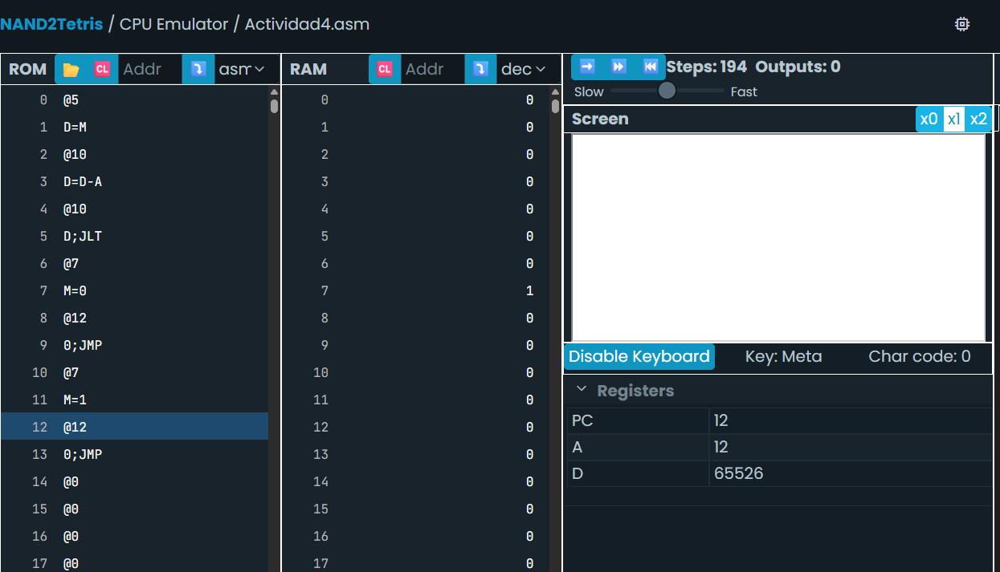

# Actividad 4: Control de flujo con saltos

- **Objetivo:** ¿Qué se buscaba aprender o lograr?
- **Proceso:** Pasos que seguiste para completar la actividad
- **Resultados:** Lo que obtuviste o lograste
- **Aprendizaje:** Conceptos nuevos que adquiriste
- **Dificultades y soluciones:** Obstáculos que encontraste y cómo los superaste
- **Conclusiones:** Reflexión sobre la importancia de lo aprendido

Vamos a resolver juntos este problema:

Escribe un programa que compare el valor almacenado en la dirección de memoria 5 con el valor 10. Si el valor es menor que 10, guarda el valor 1 en la dirección 7. Si el valor es mayor o igual a 10, guarda el valor 0 en la dirección 7.

## 📤 **Bitácora**

``@5`` apunta la direccion del registro 5
``D=M`` lo guarda en el registro temporal D
``@10`` apunta la direccion del registro 10
``D=D-A`` le resta 10 a 0
``@LOWERVALUE`` se declara una etiqueta llamada lower value es decir valor menor
``D;JLT`` le dice al programa que salte a la variable si D es menor que 0 (-10)
``@7`` apunta la dirección del registro 7
``M=0`` iguala el contenido a 0
``@END`` declaro otra etiqueta llamada END
``0;JMP`` le digo que salte a la etiqueta
``(LOWERVALUE)`` aqui le habia dicho que saltara el programa siempre y cuando el valor de D fuera menor que 0
``@7`` apunto la direccion del registro 7
``M=1`` guardo 1 en el registro 7
``(END)`` aqui le habia dicho que saltara si D era mayor o igual a 0
``@END`` Fin del programa
``0;JMP`` Salta a END

