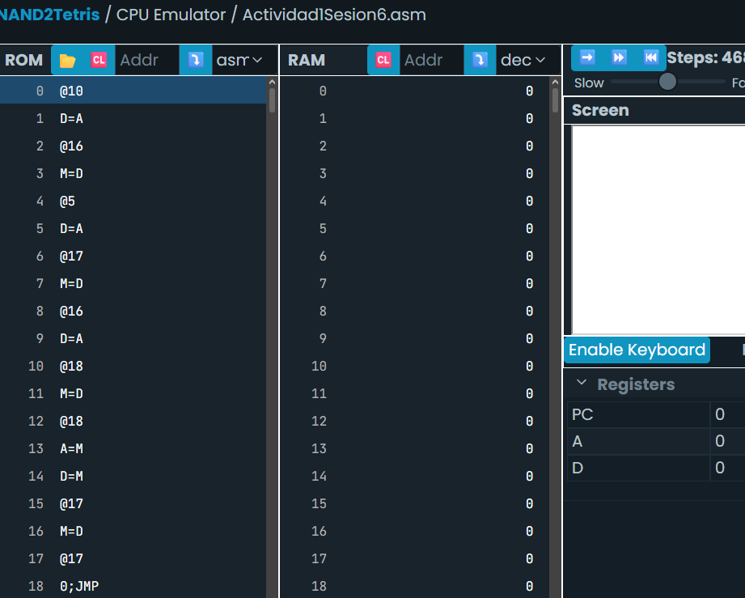
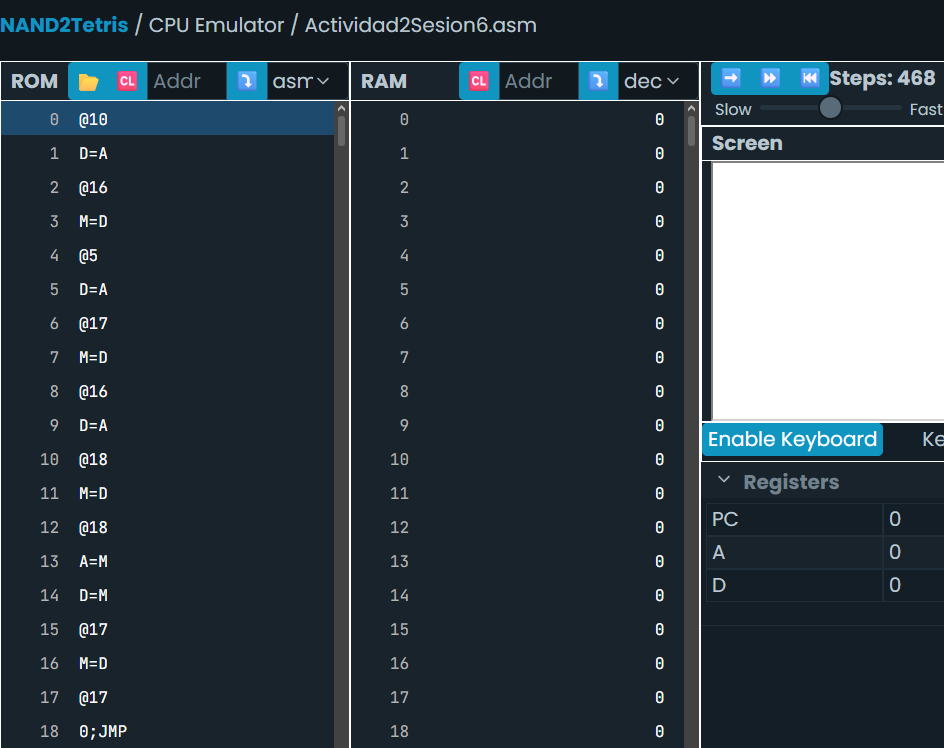

# Sesión 6. Punteros, arreglos y relación entre direcciones de memoria y código de alto nivel

Traduce el código a lenguaje ensamblador usando punteros:

```
int a = 10;
int b = 5;
int *p;
p = &a;
b = *p;
```
### Mi traducción:
```
@10
D=A
@a
M=D
@5
D=A
@b
M=D
@a
D=A
@p
M=D
@p
A=M
D=M
@b
M=D
(END)
@END
0;JMP
```



### Explicación:
El programa inicia creando dos variables: a, con el valor 10, y b, con el valor 5. Luego crea un puntero p y le asigna la dirección de memoria de a, de manera que p queda apuntando a esa variable.

Después, el programa accede al contenido de la dirección almacenada en p, es decir, al valor de a, y copia ese valor en la variable b. Como a contiene el número 10, al finalizar la ejecución b deja de valer 5 y pasa a valer 10, mientras que a conserva su valor original.

## Actividad integrada: Experimenta con arreglos
Los arreglos son colecciones de datos en la memoria.

Considera el siguiente programa

```
int arr[] = {33,44,55,12,34,56,78,98,76,54};
int sum = 0;
for (int j = 0; j < 10; j++) {
	sum = sum + arr[j];
	}
```
### Mi traducción

```
@33
D=A
@arr
M=D
@44
D=A
@arr+1
M=D
@55
D=A
@arr+2
M=D
@12
D=A
@arr+3
M=D
@34
D=A
@arr+4
M=D
@56
D=A
@arr+5
M=D
@78
D=A
@arr+6
M=D
@98
D=A
@arr+7
M=D
@76
D=A
@arr+8
M=D
@54
D=A
@arr+9
M=D
@sum
M=0
@j
M=0
(LOOP)
@j
D=M
@10
D=D-A
@END
D;JGE
@arr
D=A
@j
A=D+M
D=M
@sum
M=D+M
@j
M=M+1
@LOOP
0;JMP
(END)
@END
0;JMP
```


### Explicación:

El programa comienza almacenando en memoria los diez valores del arreglo: 33, 44, 55, 12, 34, 56, 78, 98, 76 y 54. Después crea una variable llamada **sum** y la inicializa en 0, ya que allí se irá acumulando el resultado de la suma. También crea una variable **j**, que funcionará como contador del ciclo, y la inicializa en 0.

A continuación, el programa entra en un ciclo que se repetirá mientras el valor de **j** sea menor que 10. En cada iteración, primero verifica si el contador ya llegó al final del arreglo. Si **j** es igual o mayor que 10, el programa sale del ciclo y termina la suma.

Si todavía quedan elementos por recorrer, el programa calcula la posición correspondiente del arreglo utilizando el valor de **j**, obtiene el número almacenado en esa posición y lo suma al valor actual de **sum**. De esta manera, en cada repetición se agrega un nuevo elemento del arreglo al acumulado.

Después de realizar la suma, el contador **j** aumenta en una unidad para pasar al siguiente elemento del arreglo. El programa vuelve al inicio del ciclo y repite el mismo proceso hasta que se hayan recorrido los diez elementos.

Cuando el contador alcanza el valor de 10, el ciclo finaliza y el programa entra en un bucle infinito para detener la ejecución, ya que el computador Hack no dispone de una instrucción específica para finalizar un programa. Al terminar, la variable **sum** contiene la suma de todos los valores del arreglo, que en este caso es **540**.
