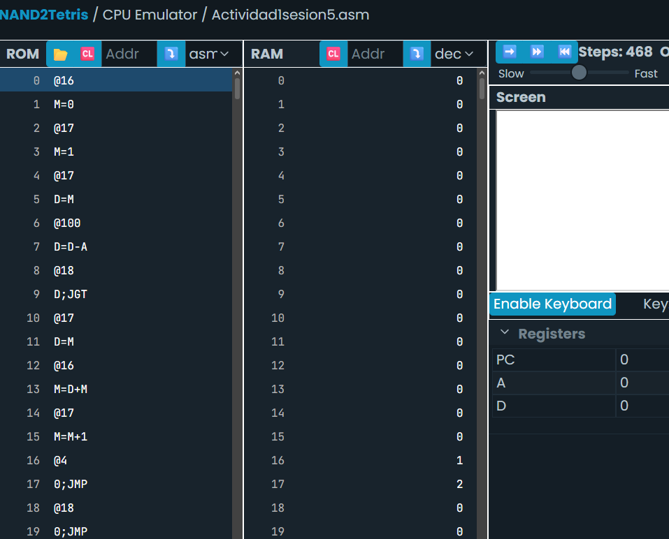

# Sesión 5. Traducción de ciclos y condicionales entre C++ y ensamblador

Transformar este código a lenguaje ensamblador usando un ciclo for:
```
//Adds 1+...+100.
int sum=0;
for(int i = 1; i <=100; i++){
	sum+= i;
	}
```
### Esta seria mi traduccion:
```
@sum
M=0

@i
M=1

(LOOP)
@i
D=M
@100
D=D-A
@END
D;JGT

@i
D=M
@sum
M=D+M

@i
M=M+1

@LOOP
0;JMP

(END)
@END
0;JMP
```


### Explicación del código:
El programa comienza creando dos variables: **sum**, que almacenará el resultado de la suma, e **i**, que actuará como contador del ciclo. Primero inicializa **sum** con el valor 0 e **i** con el valor 1.

Luego entra en un ciclo identificado por la etiqueta **LOOP**. En cada repetición, el programa verifica si el valor de **i** es mayor que 100. Para hacerlo, resta 100 al valor de **i** y, si el resultado es positivo, significa que **i** ya superó el límite del ciclo, por lo que salta a la etiqueta **END** y finaliza.

Si **i** todavía es menor o igual que 100, el programa toma el valor de **i** y lo suma al contenido de la variable **sum**, acumulando así la suma de todos los números recorridos hasta ese momento.

Después incrementa el valor de **i** en una unidad para preparar la siguiente iteración y realiza un salto incondicional de vuelta a la etiqueta **LOOP**, donde vuelve a comprobar la condición del ciclo.

Cuando **i** llega a 101, la condición indica que el ciclo ha terminado y el programa salta a la etiqueta **END**. Allí entra en un bucle infinito para detener la ejecución, ya que el computador Hack no posee una instrucción específica para finalizar un programa. En ese momento, la variable **sum** contiene el valor **5050**, que corresponde a la suma de los números del 1 al 100.
