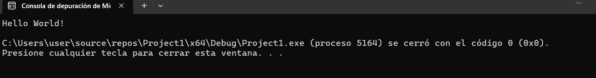
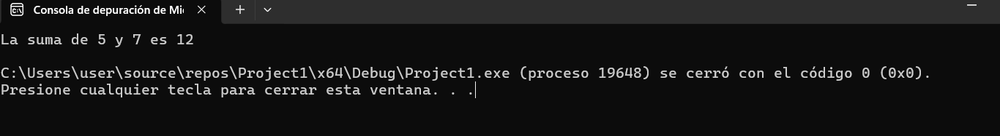
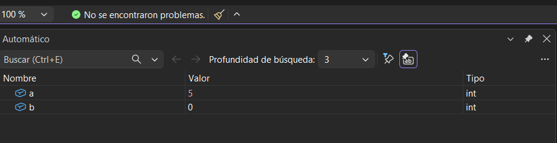
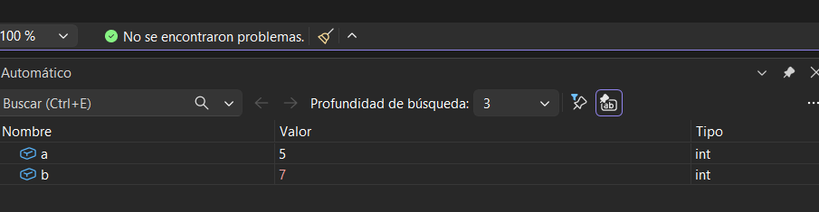
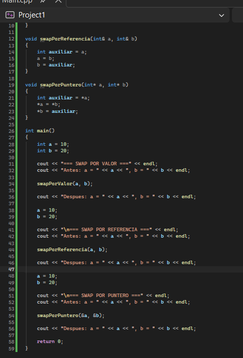
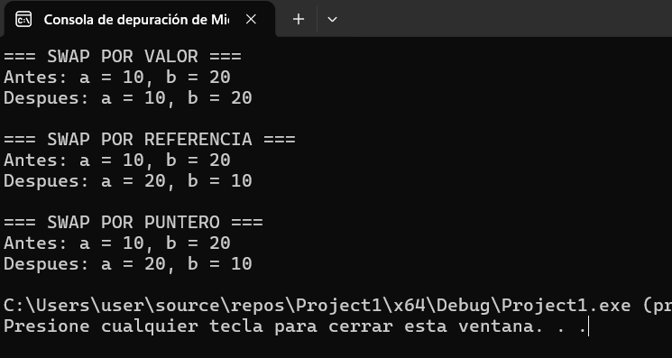

# Actividad 1
`Evidencias`




`Reflexiones`
1. ¿Para qué sirven los breakpoints?

R/ para detener la compilación del código en una línea en específico. De esta manera falicita el analisis para la verificacion del funcionamiento óptimo del código, ya que permite que sea analizado por partes.

2. ¿Para qué se usa la ventana de depuración Autos?

R/ Aquí muestran los valores que están siendo almacenados en el computador y como van cambiando deacuerdo al programa va ejecutandose.
# Actividad 2: Paso por valor y paso por referencia
Analizaremos el concepto de paso de parámetros en C++ y cómo se comporta el paso por valor, por referencia y por puntero.

```Predicciones```
- ¿Qué diferencias observas en el comportamiento de `a, b` y `c` tras cada llamada?

R/ Que al ejecutarse cada funcion en a no cambia el valor original sino que se creo una copia del numero y ese fue el que se modifico entonces a sigue siendo 10, mientras que b y c por referencia y puntero si alteraron el numero original entonces quedo en 15.

- ¿Por qué ocurre esta diferencia?

R/ Porque cada funcion modifica la informacion de manera diferente, el puntero esta indicando en que direccion esta guardado el dato, por referencia trabaja directamente sobre la variable original y por valor se trabaja con una copia de la misma para proteger ese valor.

Crea un proyecto de consola en Visual Studio. Implementa las siguientes funciones:

`swapPorValor(int a, int b)`

Esta función debe intentar intercambiar los valores de a y b pasándolos por valor. 


Nota: Se espera que el intercambio no afecte a las variables originales en `main()`.

`swapPorReferencia(int &a, int &b)`

Esta función debe intercambiar los valores de a y b utilizando paso por referencia con referencias.

`swapPorPuntero(int *a, int *b)`

Esta función debe intercambiar los valores de a y b utilizando punteros. Recuerda acceder a los valores con el operador de indirección (`*`).

1. Muestra el código con la implementación de las funciones de `swap`.
2. Muestra los resultados de las pruebas realizadas en la función `main()`.
### Codigo

### Resultados
